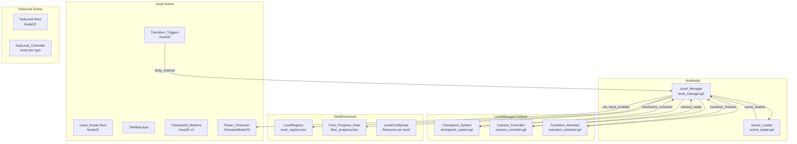
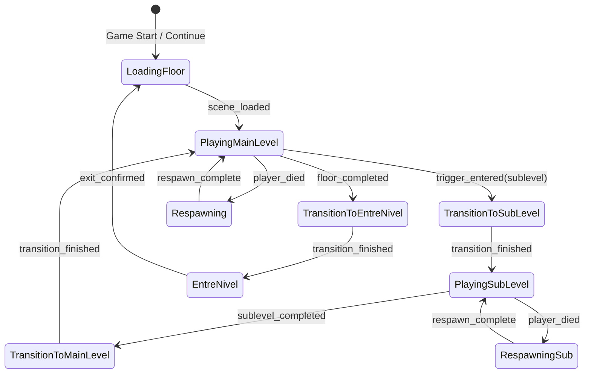
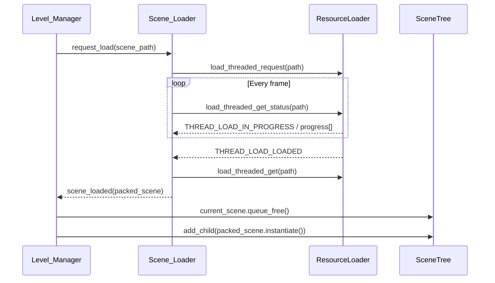

# Design Document: Level Map System

## Overview

Este documento describe la arquitectura técnica del sistema de niveles, mapa de progresión y transiciones para "Torchic". El sistema gestiona 15 niveles de progresión continua con jefes mayores cada 5 pisos, checkpoints automáticos basados en distancia, subniveles con cambios de cámara, zonas de entre-nivel (tienda con Fantasmita), y carga/descarga asíncrona de escenas.

La implementación se basa en un Autoload singleton (`Level_Manager`) que orquesta todo el flujo de niveles. Los subsistemas (`Checkpoint_System`, `Scene_Loader`, `Camera_Controller`) se comunican mediante señales de Godot, siguiendo el mismo patrón de comunicación establecido en el sistema de movimiento del jugador.

### Design Decisions

1. **Autoload singleton para Level_Manager**: Un único Autoload persiste entre escenas y coordina toda la lógica de niveles. Esto resuelve el problema fundamental de mantener estado entre cambio de escenas sin requerir nodos adicionales en cada escena.
2. **Configuración declarativa vía Resource custom**: Los niveles se definen en un `LevelRegistry` (Resource personalizado) en lugar de JSON, aprovechando el sistema de tipos de Godot para validación en editor y autocompletado.
3. **Scene_Loader como componente del Level_Manager**: En vez de un Autoload separado, el Scene_Loader es un nodo hijo del Level_Manager para mantener la jerarquía simple y la comunicación directa.
4. **Checkpoint basado en distancia horizontal**: Los checkpoints se activan por porcentaje de avance (33%, 66%) en lugar de zonas fijas, haciendo el sistema agnóstico al diseño específico de cada nivel.
5. **SubLevel como escena independiente con inyección de contexto**: Cada subnivel es una PackedScene completa que recibe su configuración (tipo, cámara, reglas) desde el Level_Manager al instanciarse.
6. **Signal-based communication**: Igual que el sistema de movimiento, todos los eventos (checkpoint alcanzado, transición completada, escena lista) se comunican via señales.
7. **Floor_Progress_Data como Resource persistible**: Usar un Resource custom permite serialización nativa con `ResourceSaver` y tipado fuerte en GDScript.

## Architecture



### Level Flow State Machine



### Scene Loading Sequence



## Components and Interfaces

### Level_Manager (Autoload - level_manager.gd)

Singleton que orquesta toda la lógica de niveles. Persiste entre escenas.

```gdscript
class_name LevelManager
extends Node

# --- Signals ---
signal floor_started(floor_id: int)
signal floor_completed(floor_id: int)
signal sublevel_entered(sublevel_config: SubLevelConfig)
signal sublevel_completed(sublevel_config: SubLevelConfig)
signal entre_nivel_entered()
signal entre_nivel_exited()
signal player_respawned(position: Vector2)
signal game_state_saved()

# --- State ---
enum GameFlowState {
    LOADING,
    PLAYING_MAIN_LEVEL,
    TRANSITION_TO_SUBLEVEL,
    PLAYING_SUBLEVEL,
    TRANSITION_TO_MAIN,
    TRANSITION_TO_ENTRE_NIVEL,
    ENTRE_NIVEL,
    RESPAWNING,
}

var current_state: GameFlowState = GameFlowState.LOADING
var current_floor_id: int = 1
var current_sublevel: SubLevelConfig = null
var player_ref: CharacterBody2D = null

# --- References (set in _ready) ---
@onready var checkpoint_system: CheckpointSystem = $CheckpointSystem
@onready var camera_controller: CameraController = $CameraController
@onready var transition_animator: TransitionAnimator = $TransitionAnimator
@onready var scene_loader: SceneLoader = $SceneLoader

# --- Resources ---
var level_registry: LevelRegistry
var floor_progress: FloorProgressData

# --- Public Methods ---
func start_game(from_save: bool = false) -> void: pass
func load_floor(floor_id: int) -> void: pass
func complete_floor() -> void: pass
func enter_sublevel(trigger: TransitionTrigger) -> void: pass
func complete_sublevel() -> void: pass
func exit_entre_nivel() -> void: pass
func handle_player_death() -> void: pass
func save_progress() -> void: pass
func get_current_floor_config() -> LevelConfigData: pass

func set_player_input_enabled(enabled: bool) -> void:
    if player_ref:
        player_ref.set_process_input(enabled)
        player_ref.set_physics_process(enabled) if not enabled else null
```

### Checkpoint_System (checkpoint_system.gd)

Gestiona checkpoints del nivel principal y subniveles.

```gdscript
class_name CheckpointSystem
extends Node

# --- Signals ---
signal checkpoint_activated(checkpoint_id: int, position: Vector2)
signal respawn_requested(position: Vector2)

# --- State ---
var active_checkpoint_position: Vector2 = Vector2.ZERO
var has_active_checkpoint: bool = false
var level_start_position: Vector2 = Vector2.ZERO
var sublevel_start_position: Vector2 = Vector2.ZERO
var is_in_sublevel: bool = false

# --- Main Level Checkpoint State ---
var checkpoint_markers: Array[CheckpointMarker] = []
var _map_start_x: float = 0.0
var _map_end_x: float = 0.0

# --- Public Methods ---
func initialize_for_level(start_pos: Vector2, map_start_x: float, map_end_x: float) -> void:
    level_start_position = start_pos
    active_checkpoint_position = start_pos
    has_active_checkpoint = false
    _map_start_x = map_start_x
    _map_end_x = map_end_x

func calculate_progress(player_x: float) -> float:
    var total_distance := _map_end_x - _map_start_x
    if total_distance <= 0.0:
        return 0.0
    return clampf((player_x - _map_start_x) / total_distance, 0.0, 1.0)

func update_checkpoints(player_x: float) -> void:
    var progress := calculate_progress(player_x)
    if progress >= 0.33 and not _checkpoint_1_active:
        _activate_checkpoint(0)
    if progress >= 0.66 and not _checkpoint_2_active:
        _activate_checkpoint(1)

func get_respawn_position() -> Vector2:
    if is_in_sublevel:
        return sublevel_start_position
    if has_active_checkpoint:
        return active_checkpoint_position
    return level_start_position

func enter_sublevel(entry_position: Vector2, sublevel_start: Vector2) -> void:
    # Save entry checkpoint in main level
    active_checkpoint_position = entry_position
    has_active_checkpoint = true
    sublevel_start_position = sublevel_start
    is_in_sublevel = true

func exit_sublevel(return_position: Vector2) -> void:
    active_checkpoint_position = return_position
    is_in_sublevel = false

# --- Private ---
var _checkpoint_1_active: bool = false
var _checkpoint_2_active: bool = false

func _activate_checkpoint(index: int) -> void:
    if index == 0:
        _checkpoint_1_active = true
    elif index == 1:
        _checkpoint_2_active = true
    var marker := checkpoint_markers[index]
    marker.activate()
    active_checkpoint_position = marker.global_position
    has_active_checkpoint = true
    checkpoint_activated.emit(index, marker.global_position)
```

### Scene_Loader (scene_loader.gd)

Gestiona carga y descarga asíncrona de escenas.

```gdscript
class_name SceneLoader
extends Node

# --- Signals ---
signal scene_loaded(scene: PackedScene)
signal load_progress_updated(progress: float)
signal load_failed(path: String, error: String)

# --- State ---
var _loading_path: String = ""
var _is_loading: bool = false
var _retry_count: int = 0
const MAX_RETRIES: int = 1

# --- Public Methods ---
func request_load(scene_path: String) -> void:
    if _is_loading:
        push_warning("SceneLoader: Already loading a scene, ignoring request for: " + scene_path)
        return
    _loading_path = scene_path
    _is_loading = true
    _retry_count = 0
    _start_load(scene_path)

func preload_scene(scene_path: String) -> void:
    # Fire-and-forget preload during Entre_Nivel
    ResourceLoader.load_threaded_request(scene_path)

func unload_scene(scene_root: Node) -> void:
    if scene_root and is_instance_valid(scene_root):
        scene_root.queue_free()

# --- Private ---
func _start_load(path: String) -> void:
    var error := ResourceLoader.load_threaded_request(path)
    if error != OK:
        _handle_load_error("Failed to start threaded load: " + str(error))
        return
    set_process(true)

func _process(_delta: float) -> void:
    if not _is_loading:
        set_process(false)
        return
    var progress: Array = []
    var status := ResourceLoader.load_threaded_get_status(_loading_path, progress)
    match status:
        ResourceLoader.THREAD_LOAD_IN_PROGRESS:
            if progress.size() > 0:
                load_progress_updated.emit(progress[0])
        ResourceLoader.THREAD_LOAD_LOADED:
            var resource := ResourceLoader.load_threaded_get(_loading_path)
            _is_loading = false
            set_process(false)
            scene_loaded.emit(resource as PackedScene)
        ResourceLoader.THREAD_LOAD_FAILED:
            _handle_load_error("Threaded load failed for: " + _loading_path)

func _handle_load_error(error_msg: String) -> void:
    push_error("SceneLoader: " + error_msg)
    if _retry_count < MAX_RETRIES:
        _retry_count += 1
        push_warning("SceneLoader: Retrying load (attempt %d)" % (_retry_count + 1))
        _start_load(_loading_path)
    else:
        _is_loading = false
        set_process(false)
        load_failed.emit(_loading_path, error_msg)
```

### Camera_Controller (camera_controller.gd)

Gestiona las perspectivas de cámara para niveles principales y subniveles.

```gdscript
class_name CameraController
extends Node

# --- Signals ---
signal camera_ready(sublevel_type: SubLevelType)
signal camera_reset()

# --- References ---
var _camera: Camera2D = null

# --- Camera Presets per SubLevel Type ---
enum SubLevelType { CHASE, INFILTRATION, PRECISION_AIMING, ENVIRONMENTAL_PUZZLE }

const CAMERA_CONFIGS: Dictionary = {
    SubLevelType.CHASE: {
        "zoom": Vector2(1.5, 1.5),
        "offset": Vector2(0, -100),
        "rotation": 0.0,
    },
    SubLevelType.INFILTRATION: {
        "zoom": Vector2(1.2, 1.2),
        "offset": Vector2(0, -50),
        "rotation": 0.0,
    },
    SubLevelType.PRECISION_AIMING: {
        "zoom": Vector2(0.7, 0.7),
        "offset": Vector2(0, -200),
        "rotation": 0.0,
    },
    SubLevelType.ENVIRONMENTAL_PUZZLE: {
        "zoom": Vector2(0.5, 0.5),
        "offset": Vector2.ZERO,
        "rotation": 0.0,
    },
}

# --- Public Methods ---
func setup_camera(camera: Camera2D) -> void:
    _camera = camera

func apply_sublevel_perspective(type: SubLevelType) -> void:
    if not _camera:
        return
    var config: Dictionary = CAMERA_CONFIGS[type]
    _camera.zoom = config["zoom"]
    _camera.offset = config["offset"]
    _camera.rotation = config["rotation"]
    camera_ready.emit(type)

func reset_to_main_level() -> void:
    if not _camera:
        return
    _camera.zoom = Vector2(1.0, 1.0)
    _camera.offset = Vector2.ZERO
    _camera.rotation = 0.0
    camera_reset.emit()

func get_perspective_for_type(type: SubLevelType) -> Dictionary:
    return CAMERA_CONFIGS.get(type, {})
```

### Transition_Animator (transition_animator.gd)

Ejecuta las animaciones de transición de 1.5 segundos.

```gdscript
class_name TransitionAnimator
extends Node

# --- Signals ---
signal transition_started(type: TransitionType)
signal transition_finished()

# --- Constants ---
const TRANSITION_DURATION: float = 1.5

enum TransitionType { DOOR, PIPE, DATA_PORTAL }

# --- State ---
var _is_transitioning: bool = false
var _tween: Tween = null

# --- Public Methods ---
func play_enter_transition(type: TransitionType) -> void:
    if _is_transitioning:
        return
    _is_transitioning = true
    transition_started.emit(type)
    _tween = create_tween()
    _tween.set_trans(Tween.TRANS_CUBIC)
    _tween.set_ease(Tween.EASE_IN_OUT)
    # Fade to black over half duration, then fade back
    _tween.tween_callback(_show_transition_effect.bind(type))
    _tween.tween_interval(TRANSITION_DURATION)
    _tween.tween_callback(_on_transition_complete)

func play_exit_transition(type: TransitionType) -> void:
    play_enter_transition(type)  # Same animation reversed

func is_transitioning() -> bool:
    return _is_transitioning

# --- Private ---
func _show_transition_effect(type: TransitionType) -> void:
    # Visual effect based on transition type
    pass

func _on_transition_complete() -> void:
    _is_transitioning = false
    transition_finished.emit()
```

### Checkpoint_Marker (checkpoint_marker.gd)

Nodo Area2D colocado en el nivel que define una posición de checkpoint.

```gdscript
class_name CheckpointMarker
extends Area2D

# --- Signals ---
signal marker_activated()

# --- State ---
var is_active: bool = false

# --- References ---
@onready var flag_sprite: Sprite2D = $CheckpointFlag
@onready var animation_player: AnimationPlayer = $AnimationPlayer

# --- Constants ---
const INACTIVE_COLOR := Color(0.5, 0.5, 0.5, 1.0)  # Grey
const ACTIVE_COLOR := Color(0.2, 0.9, 0.2, 1.0)    # Green

func _ready() -> void:
    flag_sprite.modulate = INACTIVE_COLOR
    body_entered.connect(_on_body_entered)

func activate() -> void:
    if is_active:
        return
    is_active = true
    flag_sprite.modulate = ACTIVE_COLOR
    animation_player.play("wave")
    marker_activated.emit()

func _on_body_entered(body: Node2D) -> void:
    if body is CharacterBody2D and not is_active:
        activate()
```

### Transition_Trigger (transition_trigger.gd)

Area2D que inicia transiciones entre nivel y subnivel/entre-nivel.

```gdscript
class_name TransitionTrigger
extends Area2D

# --- Signals ---
signal triggered(trigger: TransitionTrigger)

# --- Configuration ---
@export var target_type: TargetType = TargetType.SUBLEVEL
@export var sublevel_config: SubLevelConfig = null
@export var transition_visual: TransitionAnimator.TransitionType = TransitionAnimator.TransitionType.DOOR

enum TargetType { SUBLEVEL, ENTRE_NIVEL, NEXT_FLOOR }

func _ready() -> void:
    body_entered.connect(_on_body_entered)

func _on_body_entered(body: Node2D) -> void:
    if body is CharacterBody2D:
        triggered.emit(self)
```


## Data Models

### LevelRegistry (level_registry.gd)

Resource personalizado que contiene la configuración declarativa de todos los niveles.

```gdscript
class_name LevelRegistry
extends Resource

@export var levels: Array[LevelConfigData] = []

func get_level_config(floor_id: int) -> LevelConfigData:
    for config in levels:
        if config.floor_id == floor_id:
            return config
    return null

func get_total_floors() -> int:
    return levels.size()

func validate() -> Array[String]:
    var errors: Array[String] = []
    for config in levels:
        var config_errors := config.validate()
        errors.append_array(config_errors)
    return errors
```

### LevelConfigData (level_config_data.gd)

Datos de configuración para un piso individual.

```gdscript
class_name LevelConfigData
extends Resource

@export var floor_id: int = 0
@export var phase: Phase = Phase.FOREST
@export var scene_path: String = ""
@export var sublevels: Array[SubLevelConfig] = []
@export var boss_type: BossType = BossType.MINI
@export var entre_nivel_scene_path: String = "res://scenes/entre_nivel.tscn"
@export var map_length_px: float = 5000.0  # Total horizontal map length

enum BossType { MINI, MAJOR }
enum Phase { FOREST, CAVE, LABORATORY }

func get_phase_for_floor(floor_id: int) -> Phase:
    if floor_id <= 5:
        return Phase.FOREST
    elif floor_id <= 10:
        return Phase.CAVE
    else:
        return Phase.LABORATORY

func is_major_boss_floor() -> bool:
    return floor_id in [5, 10, 15]

func validate() -> Array[String]:
    var errors: Array[String] = []
    if floor_id <= 0:
        errors.append("Floor %d: floor_id must be positive" % floor_id)
    if scene_path.is_empty():
        errors.append("Floor %d: scene_path is empty" % floor_id)
    elif not ResourceLoader.exists(scene_path):
        errors.append("Floor %d: scene_path '%s' does not exist" % [floor_id, scene_path])
    for sublevel in sublevels:
        var sub_errors := sublevel.validate(floor_id)
        errors.append_array(sub_errors)
    if is_major_boss_floor() and boss_type != BossType.MAJOR:
        errors.append("Floor %d: should have MAJOR boss type" % floor_id)
    return errors
```

### SubLevelConfig (sublevel_config.gd)

Configuración para un subnivel individual.

```gdscript
class_name SubLevelConfig
extends Resource

@export var sublevel_id: String = ""
@export var sublevel_type: CameraController.SubLevelType = CameraController.SubLevelType.CHASE
@export var scene_path: String = ""
@export var transition_type: TransitionAnimator.TransitionType = TransitionAnimator.TransitionType.DOOR
@export var has_time_limit: bool = false
@export var time_limit_seconds: float = 0.0

func validate(parent_floor_id: int) -> Array[String]:
    var errors: Array[String] = []
    if sublevel_id.is_empty():
        errors.append("Floor %d: sublevel has empty sublevel_id" % parent_floor_id)
    if scene_path.is_empty():
        errors.append("Floor %d, SubLevel '%s': scene_path is empty" % [parent_floor_id, sublevel_id])
    elif not ResourceLoader.exists(scene_path):
        errors.append("Floor %d, SubLevel '%s': scene_path '%s' does not exist" % [parent_floor_id, sublevel_id, scene_path])
    if has_time_limit and time_limit_seconds <= 0.0:
        errors.append("Floor %d, SubLevel '%s': has_time_limit is true but time_limit_seconds <= 0" % [parent_floor_id, sublevel_id])
    return errors
```

### FloorProgressData (floor_progress_data.gd)

Recurso persistible que almacena el progreso del jugador.

```gdscript
class_name FloorProgressData
extends Resource

@export var highest_floor_reached: int = 1
@export var current_floor: int = 1
@export var completed_sublevels: Dictionary = {}  # {floor_id: [sublevel_ids]}
@export var active_checkpoints: Dictionary = {}   # {floor_id: checkpoint_index}

# --- Player State (transferred between scenes) ---
@export var player_hp: int = 100
@export var player_tokens: int = 0
@export var player_exp: int = 0
@export var player_level: int = 1
@export var player_equipment: Array[String] = []  # equipment resource paths

const SAVE_PATH: String = "user://floor_progress.tres"

func update_floor_completed(floor_id: int) -> void:
    if floor_id > highest_floor_reached:
        highest_floor_reached = floor_id
    current_floor = mini(floor_id + 1, 15)

func mark_sublevel_completed(floor_id: int, sublevel_id: String) -> void:
    if not completed_sublevels.has(floor_id):
        completed_sublevels[floor_id] = []
    if sublevel_id not in completed_sublevels[floor_id]:
        completed_sublevels[floor_id].append(sublevel_id)

func save_to_disk() -> Error:
    return ResourceSaver.save(self, SAVE_PATH)

static func load_from_disk() -> FloorProgressData:
    if ResourceLoader.exists(SAVE_PATH):
        var loaded := ResourceLoader.load(SAVE_PATH)
        if loaded is FloorProgressData:
            return loaded
    return FloorProgressData.new()

func capture_player_state(player: CharacterBody2D) -> void:
    # Called before scene transitions to snapshot player data
    # Actual fields depend on player script implementation
    pass

func restore_player_state(player: CharacterBody2D) -> void:
    # Called after scene transitions to restore player data
    pass
```

### PlayerStateSnapshot

Estructura intermedia para transferir estado del jugador entre escenas.

```gdscript
# Stored in FloorProgressData during transitions
# Fields represent all mutable player state that must persist:
# - player_hp: current health points
# - player_tokens: currency collected
# - player_exp: experience points
# - player_level: current level (1-15)
# - player_equipment: list of equipped item paths
```

### Level Progression Table

Las 3 fases temáticas del juego representan una progresión narrativa: naturaleza reconquistando tecnología → tecnología abandonada en cuevas → el corazón tecnológico (laboratorio) donde habita el virus final.

```
FASE 1: BOSQUE TECNOLÓGICO (Pisos 1-5)
Ambientación: Bosque denso con ruinas tecnológicas antiguas consumidas por la flora.
Vegetación creciendo sobre servidores oxidados, cables cubiertos de musgo, pantallas rotas con enredaderas.

Floor | Boss Type | Sub-Levels             | Notes
------|-----------|------------------------|---------------------------
1     | MINI      | 1 CHASE               | Tutorial - sendero del bosque con raíces mecánicas
2     | MINI      | 1 INFILTRATION         | Ruinas de antena cubierta de hiedra
3     | MINI      | 1 PUZZLE               | Terminal vieja entre árboles - puzzle de circuitos
4     | MINI      | 1 CHASE, 1 PUZZLE      | Bosque profundo con drones averiados
5     | MAJOR     | 1 PRECISION_AIMING     | Jefe Mayor: Guardián del Bosque (robot jardinero corrupto)

FASE 2: CUEVA TECNOLÓGICA (Pisos 6-10)
Ambientación: Sistema de cuevas subterráneas con restos tecnológicos menos dañados.
Servidores parcialmente funcionales, luces LED parpadeantes, cables activos, cristales que reflejan datos.

Floor | Boss Type | Sub-Levels             | Notes
------|-----------|------------------------|---------------------------
6     | MINI      | 2 mixed                | Entrada a las cuevas - transición flora → roca + tech
7     | MINI      | 2 mixed                | Túneles con raíles de datos luminosos
8     | MINI      | 2 mixed                | Cámara de servidores semi-activos
9     | MINI      | 2 mixed                | Río de coolant con plataformas de hardware
10    | MAJOR     | 2 mixed                | Jefe Mayor: Centinela de la Cueva (IA de seguridad)

FASE 3: LABORATORIO (Pisos 11-15)
Ambientación: Laboratorio tecnológico avanzado, totalmente funcional y hostil.
Ambiente estéril, hologramas, láseres, compuertas automáticas, estética cyberpunk/digital.

Floor | Boss Type | Sub-Levels             | Notes
------|-----------|------------------------|---------------------------
11    | MINI      | 3 mixed                | Sector de pruebas - trampas láser
12    | MINI      | 3 mixed                | Cámaras de contención con anomalías digitales
13    | MINI      | 3 mixed                | Núcleo de procesamiento - plataformas holográficas
14    | MINI      | 3 mixed                | Sala del mainframe - defensas máximas
15    | MAJOR     | 3 mixed                | JEFE FINAL: El Virus (entidad digital que corrompe el entorno)
```

## Correctness Properties

*A property is a characteristic or behavior that should hold true across all valid executions of a system — essentially, a formal statement about what the system should do. Properties serve as the bridge between human-readable specifications and machine-verifiable correctness guarantees.*

### Property 1: Level Sequencing

*For any* floor N in [1, 14], completing floor N SHALL result in the game transitioning to the Entre_Nivel scene before loading floor N+1. The sequence is always: floor N → entre_nivel → floor N+1.

**Validates: Requirements 1.3, 9.1**

### Property 2: Boss Type Determination

*For any* floor N in [1, 15], the boss type SHALL be MAJOR if and only if N is in the set {5, 10, 15}. For all other floors, the boss type SHALL be MINI.

**Validates: Requirements 1.4**

### Property 3: Progress Calculation

*For any* player horizontal position `player_x`, map start position `start_x`, and map end position `end_x` where `end_x > start_x`, the Level_Progress SHALL equal `clamp((player_x - start_x) / (end_x - start_x), 0.0, 1.0)`.

**Validates: Requirements 2.1**

### Property 4: Checkpoint Activation by Progress Threshold

*For any* Level_Progress value `p` in [0.0, 1.0]: (a) if `p >= 0.33` then checkpoint 1 SHALL be active; (b) if `p >= 0.66` then checkpoint 2 SHALL be active; (c) checkpoints once activated SHALL never deactivate within the same level.

**Validates: Requirements 2.2, 2.3**

### Property 5: Respawn Position Selection

*For any* player death event in the main level: the respawn position SHALL be the position of the most recently activated checkpoint. If no checkpoint has been activated, the respawn position SHALL be the level start position.

**Validates: Requirements 2.4, 2.5**

### Property 6: Sublevel Death Isolation

*For any* player death within a Sub_Level, the Floor_Progress_Data of the main level (including highest_floor_reached, active_checkpoints, and completed_sublevels) SHALL remain identical to its state before the death event. The player SHALL respawn at the sublevel's start position.

**Validates: Requirements 3.3, 3.4, 3.5**

### Property 7: Input Disabled During Transition

*For any* input action (move_left, move_right, jump, interact) attempted while a Transition_Animation is executing (`is_transitioning == true`), that input SHALL NOT produce any effect on the Player_Character's state or position.

**Validates: Requirements 4.2**

### Property 8: Camera-SubLevel Type Correspondence

*For any* Sub_Level_Type value, after the transition animation completes, the Camera2D configuration (zoom, offset, rotation) SHALL match the predefined preset for that Sub_Level_Type exactly.

**Validates: Requirements 4.3, 5.1, 6.1, 7.1, 8.1**

### Property 9: CHASE Auto-Forward Velocity

*For any* frame during an active CHASE Sub_Level, the Player_Character's forward velocity component SHALL equal the configured constant chase speed, regardless of player input on the forward axis.

**Validates: Requirements 5.2**

### Property 10: Puzzle Completion Condition

*For any* ENVIRONMENTAL_PUZZLE Sub_Level with N required switches, the exit door SHALL open if and only if all N switches are in the active state simultaneously.

**Validates: Requirements 8.4**

### Property 11: Player State Preservation During Transitions

*For any* player state (HP, tokens, EXP, level, equipment) captured before a scene transition, the state after the transition completes SHALL be identical to the state before — no fields lost, corrupted, or modified.

**Validates: Requirements 9.5, 11.2**

### Property 12: Floor Progress Data Accuracy

*For any* sequence of floor completions [f1, f2, ..., fn], the `highest_floor_reached` field in Floor_Progress_Data SHALL equal `max(f1, f2, ..., fn)`, and `current_floor` SHALL equal `min(max_floor + 1, 15)`.

**Validates: Requirements 1.5, 11.1, 11.3**

### Property 13: Save/Load Round-Trip

*For any* valid FloorProgressData instance, calling `save_to_disk()` followed by `load_from_disk()` SHALL produce a FloorProgressData instance with all fields equal to the original.

**Validates: Requirements 11.4, 11.5**

### Property 14: Configuration Validation

*For any* LevelConfigData entry, the validation function SHALL return an empty error list if and only if all required fields are present (floor_id > 0, scene_path non-empty and exists, all sublevel configs have valid types and paths, boss_type matches floor rules).

**Validates: Requirements 12.2, 12.4**

### Property 15: Load Retry on Failure

*For any* scene load that fails, the Scene_Loader SHALL retry exactly once. If the retry also fails, a `load_failed` signal SHALL be emitted. The total number of load attempts SHALL never exceed 2 (initial + 1 retry).

**Validates: Requirements 10.5**

## Error Handling

### Scene Loading Errors
- **Scene path does not exist**: `SceneLoader` logs error with path, retries once. On second failure emits `load_failed` signal. Level_Manager shows error UI to player with option to retry or return to menu.
- **ResourceLoader threaded request fails to start**: Immediate retry. If second attempt fails, fall back to synchronous `load()` as last resort.
- **Scene loads but instantiation fails**: Caught by Level_Manager, logged, player returned to previous valid state.

### Configuration Errors
- **Missing or invalid level registry**: Level_Manager logs all validation errors at startup with specific floor and field. Game refuses to start without minimum valid configuration.
- **Scene path references deleted file**: Caught during validation and during runtime load. Both produce descriptive error messages.
- **Sublevel type mismatch**: If a sublevel scene doesn't match its configured type, Camera_Controller uses safe defaults.

### State Management Errors
- **Save file corruption**: `load_from_disk()` returns a fresh `FloorProgressData` if the loaded resource fails type checking. Player starts from floor 1.
- **Player reference lost during transition**: Level_Manager re-finds player via `get_tree().get_first_node_in_group("player")` after scene change. If not found, logs critical error.
- **Null checkpoint position**: `get_respawn_position()` always returns `level_start_position` as the ultimate fallback — never `Vector2.ZERO`.

### Transition Edge Cases
- **Double-trigger prevention**: `TransitionTrigger` disconnects its signal after first activation to prevent multiple transitions from rapid player movement.
- **Transition interrupted by death**: If player somehow dies during transition animation, the transition completes first, then death is processed in the new scene.
- **Input during transition**: Physics process and input handling are disabled on the player node. Restored immediately after `transition_finished` signal.

### Checkpoint Edge Cases
- **Player moves backward past checkpoint**: Checkpoints are one-way — once activated, they remain active regardless of player position. Progress can only increase checkpoint state.
- **Multiple checkpoints activated in same frame**: Both activate in order (33% first, then 66%), with the highest becoming the Active_Checkpoint.
- **Death at exact threshold boundary**: The `>=` comparison ensures the checkpoint activates before respawn logic runs in the same frame.

## Testing Strategy

### Property-Based Tests (GDScript + GUT framework)

Se utilizará el framework **GUT** (Godot Unit Test) para tests unitarios y de propiedades. Para property-based testing, se implementarán generators de datos aleatorios que alimentan las propiedades.

**Configuration:**
- Minimum 100 iterations per property test
- Each test tagged with: `Feature: level-map-system, Property {N}: {title}`
- Random seed logged for reproducibility

**Library:** GUT (gdUnit4 como alternativa)

**Properties to implement as PBT:**
1. Property 2: Boss Type Determination — generate all 15 floor IDs + random invalid IDs
2. Property 3: Progress Calculation — generate random player_x, start_x, end_x values
3. Property 4: Checkpoint Activation — generate random progress sequences [0.0, 1.0]
4. Property 5: Respawn Position Selection — generate random checkpoint activation states + death events
5. Property 6: Sublevel Death Isolation — generate random FloorProgressData + simulate deaths
6. Property 9: CHASE Auto-Forward Velocity — generate random input combinations during chase
7. Property 10: Puzzle Completion Condition — generate random switch state combinations
8. Property 11: Player State Preservation — generate random player states + simulate transitions
9. Property 12: Floor Progress Accuracy — generate random sequences of floor completions
10. Property 13: Save/Load Round-Trip — generate random FloorProgressData instances
11. Property 14: Config Validation — generate valid and invalid LevelConfigData entries
12. Property 15: Load Retry — simulate load failures + successes in sequences

### Unit Tests (Example-Based)

- Level_Manager initializes in LOADING state (smoke)
- Floor 5 has MAJOR boss type (Req 1.4, example)
- Progress = 0.0 at map start, 1.0 at map end (Req 2.1, edge cases)
- Checkpoint flag changes from grey to green on activation (Req 2.8)
- Checkpoint wave animation plays (Req 2.9)
- Transition duration is exactly 1.5 seconds (Req 4.1)
- CHASE sublevel allows lateral movement but not forward control (Req 5.2, 5.3)
- INFILTRATION allows forward + lateral + jump (Req 6.2)
- PRECISION_AIMING enables mouse cursor and projectiles (Req 7.3)
- ENVIRONMENTAL_PUZZLE enables 4-directional movement (Req 8.2)
- Fantasmita NPC is present in Entre_Nivel (Req 9.2)
- Shop interface opens on Fantasmita interaction (Req 9.3)
- Preload starts during Entre_Nivel (Req 10.6)
- Invalid config logs descriptive error with floor ID (Req 12.4)

### Integration Tests

- Full floor cycle: load floor → play → checkpoints activate → complete → entre_nivel → next floor
- Sublevel cycle: trigger → transition → play sublevel → complete → return to main level
- Death and respawn: die at various progress points → verify correct respawn position
- Save/load cycle: complete floors → save → restart → verify floor loaded correctly
- CHASE sublevel: obstacles spawn → player dodges → reaches exit → returns
- Transition to sublevel with preloaded scene vs non-preloaded scene
- Multiple sublevels in one floor without state corruption
