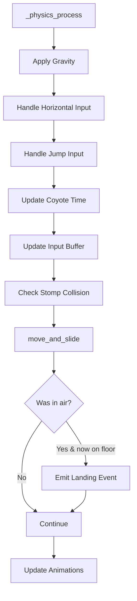

# Design Document: Player Core Movement

## Overview

Este documento describe la arquitectura técnica para el sistema de movimiento principal del jugador en "Torchic", un platformer 2D en Godot 4.x con GDScript. El sistema cubre movimiento horizontal instantáneo, salto variable, gravedad asimétrica, pisotón con rebote, coyote time, input buffering, evento de aterrizaje y un sistema de modificadores de velocidad extensible.

La implementación se basa en `CharacterBody2D` de Godot 4.x, usando `_physics_process()` para toda la lógica de movimiento. El diseño prioriza la separación de responsabilidades para facilitar la integración futura con sistemas de combate, equipamiento e IA enemiga.

### Design Decisions

1. **Single script approach with composition signals**: El `Movement_Controller` vive en un solo script `player.gd` adjunto al nodo `CharacterBody2D`. Los sistemas externos (equipamiento, nivel, combate) interactúan mediante señales y setters públicos — no herencia.
2. **No state machine for movement**: En lugar de un FSM formal, usamos flags booleanos (`is_on_floor()`, `is_ascending`, `has_coyote`) porque los estados de movimiento en un platformer 2D simple son mutuamente derivables del estado físico. Esto reduce la complejidad sin perder claridad.
3. **Export vars for tuning**: Todos los parámetros de game feel (`jump_impulse`, `coyote_duration`, `buffer_window`, etc.) son `@export` para ajuste en el editor sin tocar código.
4. **Signal-based communication**: El controlador emite señales (`landed`, `stomped`) que otros sistemas observan. El controlador no conoce al sistema de equipamiento ni al sistema de nivel — solo expone métodos para recibir modificadores.

## Architecture

```mermaid
graph TD
    subgraph PlayerCharacter [Player - CharacterBody2D]
        MC[MovementController<br/>player.gd]
        SP[Sprite2D]
        CS[CollisionShape2D]
        SC[StompDetector<br/>Area2D]
    end

    subgraph ExternalSystems
        EQ[EquipmentSystem]
        LV[LevelSystem]
        AN[AnimationController]
        EN[EnemyManager]
    end

    MC -->|signal: landed| AN
    MC -->|signal: stomped| AN
    MC -->|signal: speed_changed| UI[HUD]
    EQ -->|set_speed_modifier()| MC
    EQ -->|set_jump_modifier()| MC
    EQ -->|set_double_jump_enabled()| MC
    EQ -->|set_stomp_multiplier()| MC
    LV -->|set_base_speed()| MC
    SC -->|body_entered| MC
    EN -->|provides armor info| SC
```

### Physics Loop Flow



## Components and Interfaces

### MovementController (player.gd)

El script principal adjunto al nodo `CharacterBody2D`. Gestiona toda la lógica de movimiento.

```gdscript
class_name PlayerMovementController
extends CharacterBody2D

# --- Signals ---
signal landed(impact_velocity: float)
signal stomped(enemy: Node2D)
signal speed_changed(new_effective_speed: float)

# --- Exported Tuning Parameters ---
@export_group("Horizontal Movement")
@export var base_move_speed: float = 300.0  # pixels/sec at base_speed_multiplier = 1.0

@export_group("Jump")
@export var jump_impulse: float = -600.0
@export var jump_cut_factor: float = 0.4
@export var max_jump_hold_time: float = 0.2  # seconds
@export var min_jump_height_factor: float = 0.3

@export_group("Gravity")
@export var gravity_up_multiplier: float = 1.0
@export var gravity_down_multiplier: float = 1.6
@export var terminal_velocity: float = 900.0

@export_group("Stomp Bounce")
@export var stomp_bounce_impulse: float = -500.0
@export var stomp_bounce_held_multiplier: float = 1.4

@export_group("Coyote Time & Input Buffer")
@export var coyote_time_duration: float = 0.1  # seconds
@export var input_buffer_duration: float = 0.12  # seconds

@export_group("Landing")
@export var landing_velocity_threshold: float = 200.0

# --- Runtime State ---
var base_speed_multiplier: float = 1.0  # from LevelSystem (1.0 to 1.7)
var speed_modifier: float = 0.0  # from EquipmentSystem (0.0 to 0.5)
var jump_height_modifier: float = 0.0  # percentage from equipment
var stomp_multiplier: float = 1.0  # from equipment
var double_jump_enabled: bool = false
var _has_double_jumped: bool = false

var _coyote_timer: float = 0.0
var _input_buffer_timer: float = 0.0
var _is_jump_held: bool = false
var _jump_hold_timer: float = 0.0
var _was_on_floor: bool = true
var _pre_land_velocity_y: float = 0.0

# --- Computed Properties ---
var effective_speed: float:
    get:
        return base_move_speed * (base_speed_multiplier + speed_modifier)
```

### Public Interface Methods

```gdscript
# Called by EquipmentSystem when boots change
func set_speed_modifier(value: float) -> void:
    speed_modifier = clampf(value, 0.0, 0.5)
    speed_changed.emit(effective_speed)

# Called by EquipmentSystem for jump-enhancing gear
func set_jump_modifier(percentage: float) -> void:
    jump_height_modifier = percentage

# Called by EquipmentSystem for stomp-enhancing gear
func set_stomp_multiplier(value: float) -> void:
    stomp_multiplier = value

# Called by EquipmentSystem when boots grant double jump
func set_double_jump_enabled(enabled: bool) -> void:
    double_jump_enabled = enabled

# Called by LevelSystem when player levels up
func set_base_speed(level: int) -> void:
    base_speed_multiplier = _calculate_base_speed_for_level(level)
    speed_changed.emit(effective_speed)
```

### StompDetector (Area2D child node)

Un `Area2D` posicionado debajo del `CollisionShape2D` del jugador. Detecta colisiones con enemigos desde arriba.

```gdscript
# Configured in editor:
# - CollisionShape2D: small rectangle at player's feet
# - Collision Layer: Player Stomp (layer 3)
# - Collision Mask: Enemies (layer 2)
# - Monitoring: true
# - Monitorable: false
```

Cuando un cuerpo entra en el `StompDetector`:
1. Se verifica que el jugador está descendiendo (`velocity.y > 0`)
2. Se verifica que el enemigo no tiene `Armadura M` (consultando `enemy.has_armor_m`)
3. Si ambas condiciones se cumplen, se aplica el `Stomp_Bounce`

### AnimationController (future component)

Observa señales del `MovementController`:
- `landed` → reproduce animación de aterrizaje (squash)
- `stomped` → reproduce efecto de impacto + partículas

## Data Models

### Speed Progression Table

La tabla mapea nivel del jugador (1–15) a `base_speed_multiplier`:

```gdscript
const SPEED_TABLE: Array[float] = [
    1.0,   # Level 1
    1.0,   # Level 2
    1.1,   # Level 3
    1.1,   # Level 4
    1.2,   # Level 5
    1.2,   # Level 6
    1.3,   # Level 7
    1.3,   # Level 8
    1.4,   # Level 9
    1.4,   # Level 10
    1.5,   # Level 11
    1.5,   # Level 12
    1.6,   # Level 13
    1.6,   # Level 14
    1.7,   # Level 15
]

func _calculate_base_speed_for_level(level: int) -> float:
    var clamped_level := clampi(level, 1, 15)
    return SPEED_TABLE[clamped_level - 1]
```

Para interpolación entre niveles (si se necesita progresión suave):

```gdscript
func _interpolate_speed_for_level(level: int, progress_to_next: float) -> float:
    var current := _calculate_base_speed_for_level(level)
    var next := _calculate_base_speed_for_level(mini(level + 1, 15))
    return lerpf(current, next, progress_to_next)
```

### Equipment Modifier Data

```gdscript
# Resource class for boot items
class_name BootsData
extends Resource

@export var speed_bonus: float = 0.0        # [0.0, 0.5]
@export var jump_bonus_percent: float = 0.0  # percentage increase
@export var enables_double_jump: bool = false
@export var stomp_multiplier: float = 1.0    # 1.0 = normal, 2.0 = gravitational boots
```

### Movement State Snapshot (for debugging/replay)

```gdscript
class MovementSnapshot:
    var velocity: Vector2
    var is_on_floor: bool
    var coyote_active: bool
    var buffer_active: bool
    var effective_speed: float
    var jump_held: bool
```

## Correctness Properties

*A property is a characteristic or behavior that should hold true across all valid executions of a system — essentially, a formal statement about what the system should do. Properties serve as the bridge between human-readable specifications and machine-verifiable correctness guarantees.*

### Property 1: Instant Horizontal Velocity

*For any* direction input (left, right, or none) and *for any* player state (Ground_State or Air_State), on the frame the input is processed, `velocity.x` SHALL equal `direction * effective_speed` when direction is non-zero, and `0.0` when direction is zero — with no intermediate transitional values.

**Validates: Requirements 1.1, 1.2, 1.4, 1.5**

### Property 2: Effective Speed Formula

*For any* `base_speed_multiplier` in [1.0, 1.7] and *for any* `speed_modifier` in [0.0, 0.5], `effective_speed` SHALL equal `base_move_speed * (base_speed_multiplier + speed_modifier)`.

**Validates: Requirements 1.3, 8.1**

### Property 3: Variable Jump Cut

*For any* ascending velocity (velocity.y < 0) at the moment the jump button is released, the resulting velocity SHALL be `velocity.y * jump_cut_factor`, effectively shortening the jump.

**Validates: Requirements 2.3**

### Property 4: Jump Hold Sustains Ascent

*For any* frame where the jump button is held and the player is ascending and `jump_hold_timer < max_jump_hold_time`, the jump cut SHALL NOT be applied — the player continues ascending under normal gravity only.

**Validates: Requirements 2.2**

### Property 5: Gravity Model with Terminal Velocity

*For any* frame where the player is in Air_State: (a) if ascending (velocity.y < 0), gravity applied SHALL be `project_gravity * gravity_up_multiplier * delta`; (b) if descending (velocity.y >= 0), gravity applied SHALL be `project_gravity * gravity_down_multiplier * delta`; and (c) `velocity.y` SHALL never exceed `terminal_velocity`.

**Validates: Requirements 3.1, 3.2, 3.3**

### Property 6: Stomp Bounce Conditions

*For any* collision between the Player and an enemy: a Stomp_Bounce SHALL be applied if and only if (a) the player's `velocity.y > 0` (descending), (b) the collision is from above (StompDetector triggered), and (c) the enemy does NOT have `Armadura M`.

**Validates: Requirements 4.1**

### Property 7: Stomp Bounce Amplification

*For any* Stomp_Bounce event, the applied impulse SHALL equal `stomp_bounce_impulse * stomp_multiplier` when jump is NOT held, and `stomp_bounce_impulse * stomp_multiplier * stomp_bounce_held_multiplier` when jump IS held during the bounce frame.

**Validates: Requirements 4.3, 4.4**

### Property 8: Coyote Time Window

*For any* frame after the player leaves Ground_State without jumping: jump SHALL be permitted if and only if `coyote_timer > 0`. Upon executing a coyote jump, `coyote_timer` SHALL immediately be set to 0, preventing a second jump in the same window.

**Validates: Requirements 5.2, 5.3, 5.4**

### Property 9: Input Buffer Round-Trip

*For any* jump press while airborne and unable to jump: if the player lands within `input_buffer_duration` seconds of the press, a jump SHALL execute on the landing frame. If `input_buffer_duration` expires before landing, the buffered input SHALL be discarded and no jump occurs on landing.

**Validates: Requirements 6.1, 6.2, 6.3**

### Property 10: Landing Event Threshold Gate

*For any* transition from Air_State to Ground_State, the `landed` signal SHALL be emitted if and only if the absolute value of the vertical velocity immediately before landing exceeds `landing_velocity_threshold`.

**Validates: Requirements 7.3**

### Property 11: Equipment Modifier Round-Trip

*For any* equipment item with a speed bonus, equipping it SHALL set `speed_modifier` to the item's value, and unequipping it SHALL revert `speed_modifier` to the value prior to equipping (or 0.0 if no other item is active).

**Validates: Requirements 8.2, 8.3**

### Property 12: Speed Modifier Range Invariant

*For any* sequence of equip/unequip operations, `speed_modifier` SHALL always remain within the range [0.0, 0.5].

**Validates: Requirements 8.6**

### Property 13: Double Jump Once Per Air Cycle

*For any* air cycle (from leaving ground to returning to ground) with `double_jump_enabled == true`, exactly one additional mid-air jump SHALL be permitted. Subsequent mid-air jump attempts SHALL be denied until the player returns to Ground_State.

**Validates: Requirements 8.5**

### Property 14: Base Speed from Level Table

*For any* player level in [1, 15], `base_speed_multiplier` SHALL equal the linearly interpolated value from the progression table (1.0 at level 1, scaling to 1.7 at level 15 with defined anchor points).

**Validates: Requirements 9.1, 9.3**

### Property 15: Jump Height Modifier Application

*For any* `jump_height_modifier` percentage from equipment, the effective jump impulse SHALL equal `jump_impulse * (1.0 + jump_height_modifier / 100.0)`.

**Validates: Requirements 8.4**

## Error Handling

### Invalid Input States
- **Simultaneous left+right**: Treated as no input (`direction = 0`). Godot's `Input.get_axis()` handles this naturally by canceling out.
- **Jump while already ascending**: Ignored unless double-jump is enabled and unused.
- **Negative speed values**: `clampf` ensures `speed_modifier` cannot produce negative effective speed.

### Boundary Conditions
- **Level out of range**: `clampi(level, 1, 15)` ensures the speed table lookup never goes out of bounds.
- **Equipment stacking**: Only one pair of boots can be active. `set_speed_modifier()` replaces (not accumulates) the value.
- **Terminal velocity**: Hard-capped with `minf(velocity.y, terminal_velocity)` every frame.

### Edge Cases
- **Stomping armored enemies**: StompDetector queries the enemy's `has_armor_m` property. If true, no bounce — the collision is passed to the damage system instead.
- **Coyote time after stomp bounce**: Coyote time is NOT activated after a stomp bounce (player left ground via impulse, not walking off edge).
- **Input buffer during coyote time**: If coyote time is active, the jump executes immediately rather than buffering.

### Signal Safety
- Signals are emitted after `move_and_slide()` completes to ensure consistent state.
- The `landed` signal includes `impact_velocity` for receivers to scale visual feedback.

## Testing Strategy

### Property-Based Tests (GDScript + GUT framework)

Se utilizará el framework **GUT** (Godot Unit Test) para tests unitarios y de propiedades. Para property-based testing, se implementarán generators de datos aleatorios que alimentan las propiedades definidas arriba.

**Configuration:**
- Minimum 100 iterations per property test
- Each test tagged with: `Feature: player-core-movement, Property {N}: {title}`
- Random seed logged for reproducibility

**Library:** GUT (gdUnit4 como alternativa si GUT no soporta generación suficiente)

**Properties to implement as PBT:**
1. Property 1: Instant Horizontal Velocity — generate random directions and states
2. Property 2: Effective Speed Formula — generate random modifier combinations
3. Property 3: Variable Jump Cut — generate random ascending velocities
4. Property 5: Gravity Model — generate random frame sequences
5. Property 8: Coyote Time Window — generate random timer values
6. Property 9: Input Buffer Round-Trip — generate random timing sequences
7. Property 12: Speed Modifier Range Invariant — generate random equip sequences
8. Property 14: Base Speed from Level Table — generate all 15 levels + fractional progress

### Unit Tests (Example-Based)

- Jump impulse applies correct value when grounded (Req 2.1)
- Minimum jump height guarantees (Req 2.4, edge case)
- Stomp bounce base magnitude is correct (Req 4.2)
- Coyote timer starts on walking off edge (Req 5.1)
- Landing signal emitted on air-to-ground transition (Req 7.1)
- Level-up updates base speed (Req 9.2)
- Animation triggered on landing signal (Req 7.2)

### Integration Tests

- Full jump cycle: press → ascend → release → cut → descend → land → signal
- Stomp bounce into input buffer → chained jump
- Equipment swap during air state doesn't cause physics glitches
- Coyote time into buffered jump edge case
