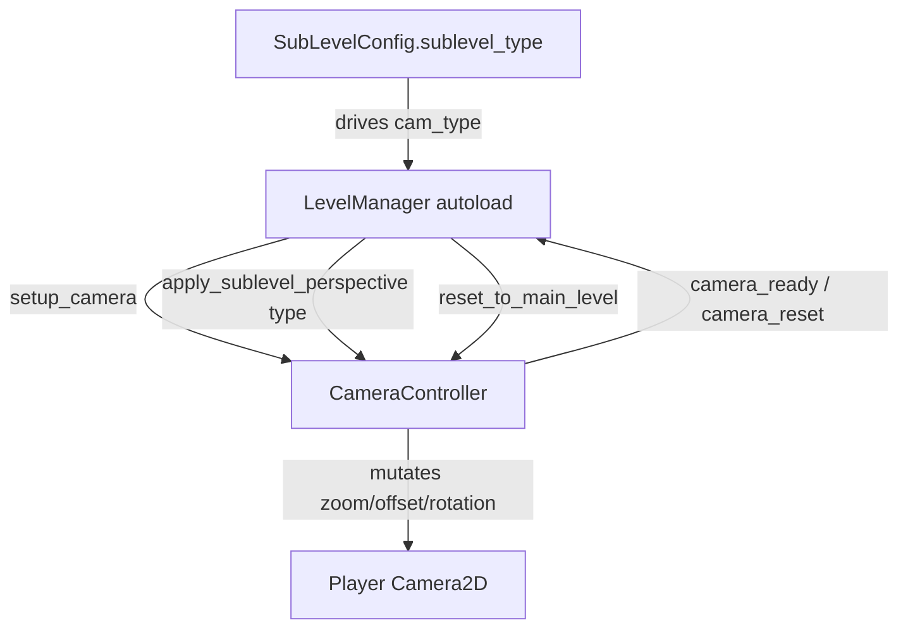
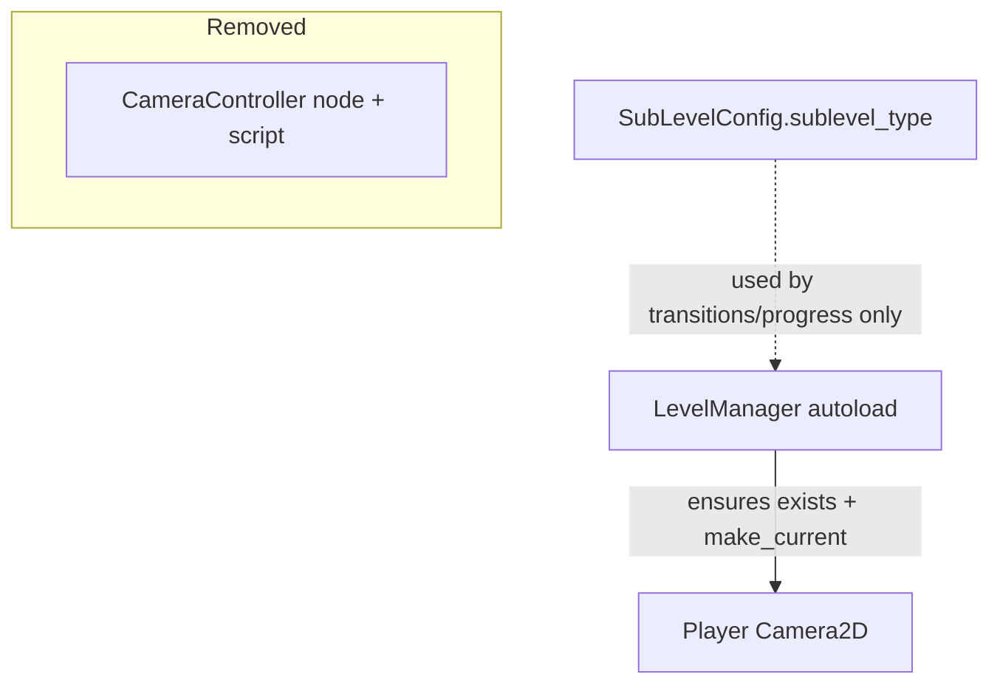

# Design Document: Remove Camera Switching

## Overview

The level system currently changes the player camera's `zoom`, `offset`, and `rotation`
each time the player enters a sub-level (via `CameraController.apply_sublevel_perspective`)
and restores them on exit (`reset_to_main_level`). This feature removes that per-sub-level
perspective switching so the camera keeps a single, consistent main-level perspective at all
times, regardless of which sub-level type the player enters.

The change decouples the camera from the sub-level flow while preserving the one piece of
camera behavior that must survive: ensuring the player's `Camera2D` exists and is `current`
after every floor load, so the world remains visible and follows the player. Sub-level
configuration data (`sublevel_type`) is retained because it identifies the sub-level for
other systems (transitions, progress, gameplay); it simply no longer drives camera state.

The high-level goal is a clean removal: delete the switching API and its data, drop the wiring
in `LevelManager`, and leave no dangling references that would cause runtime errors in this
Godot 4 GDScript project.

## Architecture

### Current architecture (before)



### Target architecture (after)



Key architectural change: the `CameraController` component and its node in
`level_manager.tscn` are removed. The camera is no longer a switchable subsystem; it is a
static, player-owned `Camera2D` that `LevelManager` provisions once per floor load. Sub-level
entry/exit no longer touch the camera at all.

## Components and Interfaces

### Component 1: LevelManager (modified)

**Purpose**: Orchestrates level flow. After this change it no longer owns or calls a camera
controller, but it still guarantees the player has a working, current camera on floor load.

**Interface (unchanged public surface, internal wiring removed)**:

```gdscript
# Removed member:
#   @onready var camera_controller: Node = $CameraController

# Removed connection in _ready():
#   camera_controller.camera_ready.connect(_on_camera_ready)

# Removed handler:
#   func _on_camera_ready(_sublevel_type) -> void

# Modified: _on_enter_sublevel_transition_finished()
#   - remove camera_controller.apply_sublevel_perspective(cam_type)
# Modified: _on_exit_sublevel_transition_finished()
#   - remove camera_controller.reset_to_main_level()
# Modified: _on_scene_loaded()
#   - keep the "ensure player Camera2D exists and make_current" logic
#   - remove camera_controller.setup_camera(...) calls
```

**Responsibilities (camera-related, after change)**:
- On floor load, locate the player's `Camera2D`; if absent, create one and `make_current()`.
- Never alter camera `zoom`, `offset`, or `rotation` during sub-level transitions.

### Component 2: CameraController (removed)

**Purpose (before)**: Held a reference to the player camera and applied/reset per-sub-level
perspectives.

**Disposition**: Deleted entirely.
- Delete `scripts/level_system/camera_controller.gd`.
- Remove the `[node name="CameraController" ...]` entry and its `ExtResource` from
  `scenes/level_system/level_manager.tscn`.

Rationale: with switching removed, the only remaining method (`setup_camera`) merely stored an
unused reference. The behavior that actually keeps the camera working (creating/making the
`Camera2D` current) already lives in `LevelManager._on_scene_loaded`. Keeping an empty
controller would be dead code, so full removal yields the cleanest decoupling.

### Component 3: SubLevelConfig (retained, decoupled)

**Purpose**: Configuration resource for a sub-level. Its `sublevel_type` field is retained for
non-camera use (identification, transitions, gameplay logic).

**Interface change**: none to the fields. Only the stale doc comment referencing
`CameraController.SubLevelType` is updated to remove the camera association.

## Data Models

### SubLevelConfig (unchanged fields)

```gdscript
enum SubLevelType { CHASE, INFILTRATION, PRECISION_AIMING, ENVIRONMENTAL_PUZZLE }

@export var sublevel_id: String
@export var sublevel_type: SubLevelType   # kept: no longer maps to a camera perspective
@export var scene_path: String
@export var transition_type: TransitionType
@export var has_time_limit: bool
@export var time_limit_seconds: float
```

**Validation rules**: unchanged. `sublevel_type` remains a valid enum value; there is simply no
camera config keyed by it anymore.

### Removed data

```gdscript
# Deleted from the system entirely:
#   const CAMERA_CONFIGS  (zoom/offset/rotation per SubLevelType)
#   enum SubLevelType     (the copy inside CameraController)
#   signal camera_ready(sublevel_type)
#   signal camera_reset()
```

## Algorithmic Pseudocode

### Sub-level entry (after change)

```gdscript
func _on_enter_sublevel_transition_finished() -> void:
    # ... validate + load + instantiate sublevel scene (unchanged) ...
    _sublevel_scene_root = sublevel_packed.instantiate()
    get_tree().current_scene.add_child(_sublevel_scene_root)
    if _current_scene_root:
        _current_scene_root.visible = false

    # REMOVED: var cam_type := current_sublevel.sublevel_type
    # REMOVED: camera_controller.apply_sublevel_perspective(cam_type)
    # Camera is intentionally left untouched — it keeps the main-level perspective.

    current_state = GameFlowState.PLAYING_SUBLEVEL
    set_player_input_enabled(true)
    sublevel_entered.emit(current_sublevel)
```

**Preconditions**: `current_sublevel` is a valid `SubLevelConfig` with a loadable scene.
**Postconditions**: sub-level scene is active; camera `zoom`/`offset`/`rotation` are identical
to their values immediately before entry.

### Sub-level exit (after change)

```gdscript
func _on_exit_sublevel_transition_finished() -> void:
    if _sublevel_scene_root and is_instance_valid(_sublevel_scene_root):
        _sublevel_scene_root.queue_free()
        _sublevel_scene_root = null

    # REMOVED: camera_controller.reset_to_main_level()
    # Nothing to reset — the camera was never changed.

    if _current_scene_root:
        _current_scene_root.visible = true
    checkpoint_system.exit_sublevel(player_ref.global_position if player_ref else Vector2.ZERO)
    if current_sublevel:
        floor_progress.mark_sublevel_completed(current_floor_id, current_sublevel.sublevel_id)
    set_player_input_enabled(true)
    var completed_sublevel = current_sublevel
    current_sublevel = null
    current_state = GameFlowState.PLAYING_MAIN_LEVEL
    sublevel_completed.emit(completed_sublevel)
```

**Preconditions**: state is `PLAYING_SUBLEVEL`.
**Postconditions**: main level visible again; camera unchanged across the full enter/exit cycle.

### Floor load camera provisioning (retained, controller calls removed)

```gdscript
# Inside _on_scene_loaded(), after player_ref is resolved:
if player_ref:
    var camera := player_ref.get_node_or_null("Camera2D") as Camera2D
    if camera == null:
        camera = Camera2D.new()
        camera.name = "Camera2D"
        player_ref.add_child(camera)
    camera.make_current()
    # REMOVED: camera_controller.setup_camera(camera)
```

**Preconditions**: a node in group `player` exists after scene instantiation.
**Postconditions**: the player has exactly one current `Camera2D`; no external component holds
mutating control over it.
**Loop invariants**: N/A (no loops in this path).

## Key Functions with Formal Specifications

### LevelManager._on_scene_loaded (camera portion)

```gdscript
func _on_scene_loaded(packed_scene: PackedScene) -> void
```

- **Preconditions**: `packed_scene` instantiates successfully; player group resolves to a
  `CharacterBody2D` (or camera provisioning is safely skipped when absent).
- **Postconditions**: if a player exists, it has a current `Camera2D`. No call to any camera
  controller is made. Camera transform properties are left at their scene/default values.
- **Side effects**: may add a `Camera2D` child to the player; sets it current.

### LevelManager._on_enter_sublevel_transition_finished

```gdscript
func _on_enter_sublevel_transition_finished() -> void
```

- **Preconditions**: valid `current_sublevel`.
- **Postconditions**: camera transform is byte-for-byte equal to its pre-call value.
- **Side effects**: none on the camera.

### LevelManager._on_exit_sublevel_transition_finished

```gdscript
func _on_exit_sublevel_transition_finished() -> void
```

- **Preconditions**: state is `PLAYING_SUBLEVEL`.
- **Postconditions**: camera transform is byte-for-byte equal to its pre-call value.
- **Side effects**: none on the camera.

## Example Usage

```gdscript
# Entering a CHASE sub-level no longer zooms the camera.
var cam := player.get_node("Camera2D") as Camera2D
var zoom_before := cam.zoom
var offset_before := cam.offset
var rot_before := cam.rotation

LevelManager.enter_sublevel(chase_trigger)   # transition + scene swap
await LevelManager.sublevel_entered

assert(cam.zoom == zoom_before)
assert(cam.offset == offset_before)
assert(cam.rotation == rot_before)

# Exiting returns to main level with the same (unchanged) camera.
LevelManager.complete_sublevel()
await LevelManager.sublevel_completed
assert(cam.zoom == zoom_before and cam.offset == offset_before and cam.rotation == rot_before)
```

## Correctness Properties

Property 1: Camera invariance on entry — For every `SubLevelType t`, entering a sub-level of
type `t` leaves `camera.zoom`, `camera.offset`, and `camera.rotation` unchanged from their
values immediately before entry.

Property 2: Camera invariance on exit — For every sub-level, completing it leaves the camera
transform unchanged from its value immediately before exit.

Property 3: Full-cycle invariance — For any enter→exit cycle, the camera transform after the
cycle equals the transform before the cycle.

Property 4: Camera availability — After any floor load with a player present, the player has
exactly one `Camera2D` and it is `current`.

Property 5: No dangling references — The project contains no references to `CameraController`,
`apply_sublevel_perspective`, `reset_to_main_level`, `setup_camera`, `camera_ready`,
`camera_reset`, `CAMERA_CONFIGS`, or `get_perspective_for_type`; no script or scene loads a
removed symbol.

Property 6: Config integrity — `SubLevelConfig.sublevel_type` remains a valid, settable enum
field and its removal from camera logic does not change `validate()` behavior.

## Error Handling

### Scenario 1: Player has no Camera2D on floor load
**Condition**: `player.get_node_or_null("Camera2D")` returns null.
**Response**: Create a `Camera2D`, add it to the player, and call `make_current()`.
**Recovery**: World stays visible; no dependency on the removed controller.

### Scenario 2: No player node found after scene load
**Condition**: `get_tree().get_first_node_in_group("player")` returns null.
**Response**: Skip camera provisioning (guarded by `if player_ref`). No error is raised by the
removed controller because no controller call exists.
**Recovery**: Downstream systems already tolerate a null `player_ref`.

### Scenario 3: Stale scene/script reference to CameraController
**Condition**: `level_manager.tscn` still references the deleted script.
**Response**: The scene fails to instantiate cleanly. Mitigation is part of the change: remove
the node and its `ExtResource` in the same edit.
**Recovery**: Verify by loading the scene in the Godot editor with no missing-dependency errors.

## Testing Strategy

### Unit / integration testing approach
- Verify the enter/exit callbacks leave the camera transform unchanged (properties 1–3), using a
  minimal player + Camera2D and a stub `SubLevelConfig`.
- Verify floor-load provisioning creates/marks a current `Camera2D` (property 4) both when a
  camera pre-exists and when it does not.
- Static/grep check that removed symbols no longer appear anywhere in `scripts/` or `scenes/`
  (property 5).
- Confirm `SubLevelConfig.validate()` output is identical before and after the change
  (property 6).

Note: this project has no existing test suite (no `test` files, though `.gdunit4.cfg` is
present). If automated tests are desired, gdUnit4 is the natural choice given the existing
config; otherwise these properties can be validated via an in-editor smoke scene.

### Property-based testing approach
**Property Test Library**: gdUnit4 (parameterized tests) — iterate property 1/2 across all four
`SubLevelType` values to assert camera invariance holds for every type.

## Performance Considerations

Negligible and net-positive: removes per-transition property writes and two signal
emissions/connections. No new allocations except the existing fallback camera creation.

## Security Considerations

None. This is a local gameplay/rendering change with no I/O, network, or auth surface.

## Dependencies

- Godot 4 engine (`Camera2D`, `make_current`, autoload singletons).
- Existing `LevelManager` autoload and `level_manager.tscn`.
- No new external libraries.

## Files Impacted

| File | Change |
|------|--------|
| `scripts/level_system/camera_controller.gd` | Delete |
| `scenes/level_system/level_manager.tscn` | Remove `CameraController` node + its `ExtResource` |
| `scripts/level_system/level_manager.gd` | Remove `camera_controller` var, `camera_ready` connection, `_on_camera_ready`, `apply_sublevel_perspective`/`reset_to_main_level`/`setup_camera` calls; keep camera provisioning |
| `scripts/level_system/data/sublevel_config.gd` | Update stale comment referencing `CameraController.SubLevelType`; keep `sublevel_type` field |
